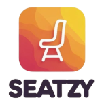

# 🎬 Seatzy - Modern Movie Booking Platform

<div align="center">
  
  
  **A comprehensive movie booking ecosystem connecting movie enthusiasts, theater partners, and entertainment experiences**
  
  [](https://seatzy.onrender.com/)
  [](https://reactjs.org/)
  [](https://nodejs.org/)
  [](https://mongodb.com/)
</div>

---

## 🎯 Project Overview & Objectives

**Seatzy** revolutionizes the movie booking experience by creating a seamless digital platform that bridges the gap between movie enthusiasts and cinema experiences. Our mission is to democratize movie ticket booking while empowering theater partners with powerful management tools.

### 🚀 Core Objectives

1. **Enhanced User Experience**: Provide an intuitive, fast, and reliable movie booking platform
2. **Theater Partnership**: Enable cinema owners to efficiently manage their operations
3. **Scalable Architecture**: Build a robust system that can handle high traffic and concurrent bookings
4. **Security First**: Implement secure payment processing and user data protection
5. **Multi-stakeholder Platform**: Serve users, theater partners, and administrators effectively

### 🎨 Project Theme

**"Bringing Cinema to Your Fingertips"** - Seatzy embodies the convergence of entertainment and technology, focusing on:
- **Accessibility**: Easy booking from anywhere, anytime
- **Transparency**: Clear pricing, seat availability, and booking confirmations
- **Community**: Connecting movie lovers with their favorite entertainment venues
- **Innovation**: Leveraging modern web technologies for superior user experience

---

## 👥 User Personas & Design Sprint Study

### 🎭 Primary Personas

#### 1. **Movie Enthusiast - "Alex"**
- **Age**: 25-35
- **Behavior**: Books movies 2-3 times per month
- **Pain Points**: Long queues, seat unavailability, complex booking processes
- **Goals**: Quick booking, seat selection, secure payments, booking history

#### 2. **Theater Partner - "Sarah"**
- **Role**: Cinema Manager/Owner
- **Needs**: Revenue tracking, show management, customer insights
- **Challenges**: Manual processes, limited digital presence
- **Goals**: Streamlined operations, increased bookings, better customer reach

#### 3. **System Administrator - "Mike"**
- **Role**: Platform Administrator
- **Responsibilities**: User management, content moderation, system oversight
- **Goals**: Efficient platform management, user satisfaction, system reliability

---

## 📋 From Definition to Planning to Development to Delivery

### 🎯 Definition Phase

**Project Conceptualization**
- Market research and competitor analysis
- User need identification through surveys and interviews
- Technical feasibility assessment
- Business model validation

**Key Stakeholder Requirements:**
- **Users**: Simple, fast booking experience
- **Theater Partners**: Comprehensive management tools
- **Business**: Scalable, profitable platform

### 📊 Planning Phase

**Architecture & Technology Decisions**
```
Frontend (React) ↔ API Gateway ↔ Backend (Node.js) ↔ Database (MongoDB)
                         ↓
                Payment Gateway (Stripe) + Email Service (Nodemailer)
```

**Feature Prioritization Matrix:**
1. **Core Features** (MVP): User auth, movie browsing, seat booking, payments
2. **Enhanced Features**: Admin panel, partner portal, email notifications
3. **Future Features**: Reviews, recommendations, mobile app

### 🛠️ Development Phase

**Agile Development Approach**
- Sprint-based development (2-week sprints)
- Continuous integration and deployment
- Test-driven development for critical components
- Regular stakeholder feedback incorporation

**Technology Architecture:**


### 🚀 Delivery Phase

**Deployment Strategy**
- Production deployment on Render.com
- Environment-specific configurations
- Performance monitoring and optimization
- User feedback collection and iteration

---

## ✨ Core Features

### 🔐 **Multi-Role Authentication System**
- **Users**: Personal profiles and booking history
- **Partners**: Theater management dashboard
- **Admins**: Platform oversight and control

### 🎬 **Movie Management**
- Browse and search extensive movie catalog
- Advanced filtering (genre, language, rating)
- Detailed movie information and trailers

### 🏛️ **Theater & Show Management**
- Interactive seat selection interface
- Real-time availability updates
- Multiple show timings and pricing

### 💳 **Secure Payment Processing**
- Stripe integration for secure transactions
- Multiple payment methods support
- Automated booking confirmations

### 📧 **Communication System**
- Email notifications for bookings
- Confirmation and reminder emails
- Partner communication tools

---

## 🏗️ Technical Architecture

### **Frontend Architecture**
```
src/
├── components/          # Reusable UI components
├── pages/              # Route-specific page components
├── redux/              # State management (Redux Toolkit)
├── api/                # API integration layer
└── utils/              # Helper functions and utilities
```

### **Backend Architecture**
```
server/
├── models/             # MongoDB schemas and models
├── routes/             # API route definitions
├── controllers/        # Business logic implementation
├── middlewares/        # Authentication and validation
├── utils/              # Helper functions and services
└── config/             # Database and environment configuration
```

### **Tech Stack**

**Frontend Technologies:**
- **React.js 18.3.1** - Modern UI framework with hooks
- **Redux Toolkit** - Predictable state management
- **Ant Design** - Professional UI component library
- **React Router** - Client-side routing
- **Axios** - HTTP client for API communication

**Backend Technologies:**
- **Node.js** - Runtime environment
- **Express.js** - Web application framework
- **MongoDB** - NoSQL database for scalability
- **Mongoose** - MongoDB object modeling
- **JWT** - Secure authentication tokens

**Integration Services:**
- **Stripe** - Payment processing
- **Nodemailer** - Email service integration
- **Bcrypt** - Password hashing and security

---

## 📚 Detailed Documentation

For comprehensive technical and user experience documentation, refer to:

- **🏗️ [Architecture Documentation](./docs/ARCHITECTURE.md)** - Technical architecture, API endpoints, database schemas
- **👥 [User Personas & Journey Maps](./docs/USER_PERSONAS.md)** - Detailed user research, personas, and experience mapping
- **🎥 [Visual Platform Guide](./docs/VISUAL_GUIDE.md)** - Flow diagrams, system architecture visualization, and user journeys
- **🎨 [Design System Guide](./docs/DESIGN_SYSTEM.md)** - UI components, styling guidelines (Coming Soon)
- **🔧 [API Documentation](./docs/API_REFERENCE.md)** - Complete API reference guide (Coming Soon)

---

## 🎭 User Journey Flow

### **Movie Enthusiast Journey**
```
🏠 Home Page → 🔍 Browse Movies → 🎬 Select Movie → 🏛️ Choose Theater → 
💺 Select Seats → 💳 Payment → ✅ Confirmation → 📧 Email Receipt
```

### **Theater Partner Journey**
```
🔐 Partner Login → 🏛️ Theater Dashboard → ➕ Add Shows → 📊 Manage Bookings → 
📈 View Analytics → 💰 Revenue Tracking
```

### **Admin Journey**
```
🔑 Admin Login → 👥 User Management → 🎬 Movie Management → 🏛️ Theater Approval → 
📊 Platform Analytics → 🛠️ System Maintenance
```

---

## 🚀 Getting Started

### 📋 Prerequisites
- **Node.js** (v14 or higher)
- **MongoDB** (Local or Atlas)
- **npm** or **yarn** package manager
- **Stripe Account** (for payment processing)

### ⚡ Quick Installation

```bash
# 1. Clone the repository
git clone https://github.com/pradeep-kr27/seatzy.git
cd seatzy

# 2. Install server dependencies
cd server
npm install

# 3. Install client dependencies
cd ../client
npm install

# 4. Environment setup
cd ../server
cp .env.example .env
# Edit .env with your configuration

# 5. Start development servers
# Terminal 1 - Backend Server
cd server
npm start

# Terminal 2 - Frontend Client
cd client
npm start
```

### 🌐 Access Points
- **Frontend Application**: `http://localhost:3000`
- **Backend API**: `http://localhost:8082`
- **Production Demo**: `https://seatzy.onrender.com/`

---

## 📁 Project Structure

```
seatzy/
│
├── 📱 client/                    # React Frontend Application
│   ├── public/                  # Static assets and logos
│   ├── src/
│   │   ├── components/          # Reusable UI components
│   │   │   ├── ProtectedRoute.js # Authentication wrapper
│   │   │   └── ...
│   │   ├── pages/               # Route-specific components
│   │   │   ├── Home/            # Movie browsing interface
│   │   │   ├── Register/        # User registration
│   │   │   ├── Partner/         # Theater partner portal
│   │   │   └── ...
│   │   ├── redux/               # State management
│   │   ├── api/                 # API communication layer
│   │   └── utils/               # Helper functions
│   └── package.json
│
├── 🖥️ server/                   # Node.js Backend API
│   ├── models/                  # MongoDB data models
│   │   ├── userModel.js         # User authentication
│   │   ├── movieModel.js        # Movie catalog
│   │   ├── theatreModel.js      # Theater information
│   │   ├── showModel.js         # Show timings
│   │   └── bookingModel.js      # Booking records
│   ├── routes/                  # API endpoints
│   │   ├── userRoutes.js        # Authentication routes
│   │   ├── movieRoutes.js       # Movie management
│   │   ├── theatreRoutes.js     # Theater operations
│   │   └── bookingRoutes.js     # Booking & payments
│   ├── controllers/             # Business logic
│   ├── middlewares/             # Authentication & validation
│   │   └── authMiddleware.js    # JWT verification
│   ├── utils/                   # Helper services
│   └── server.js                # Application entry point
│
├── 📄 README.md                 # Project documentation
└── 📋 package.json             # Project metadata
```

---

## 🔧 Configuration

### Environment Variables
```env
# Database
MONGO_URI=mongodb://localhost:27017/seatzy
DB_NAME=seatzy

# Authentication
JWT_SECRET=your_jwt_secret_key

# Payment Processing
STRIPE_SECRET_KEY=sk_test_your_stripe_secret_key
STRIPE_PUBLISHABLE_KEY=pk_test_your_stripe_publishable_key

# Email Service
EMAIL_SERVICE=gmail
EMAIL_USER=your_email@gmail.com
EMAIL_PASS=your_app_password

# Application
PORT=8082
CLIENT_URL=http://localhost:3000
```

---

## 🤝 Contributing

We welcome contributions to make Seatzy even better! Here's how you can help:

### 🛠️ Development Workflow
1. **Fork** the repository
2. **Create** a feature branch (`git checkout -b feature/amazing-feature`)
3. **Commit** your changes (`git commit -m 'Add amazing feature'`)
4. **Push** to the branch (`git push origin feature/amazing-feature`)
5. **Open** a Pull Request

### 📝 Contribution Guidelines
- Follow existing code style and conventions
- Write meaningful commit messages
- Add tests for new features
- Update documentation as needed
- Ensure all tests pass before submitting

---

## 📄 License

This project is licensed under the **MIT License** - see the [LICENSE](LICENSE) file for details.

---

## 🚀 Deployment & Production

### Live Demo
**🌐 [Visit Seatzy Live](https://seatzy.onrender.com/)**

### Production Features
- **Secure HTTPS** encryption
- **Automated deployments** via GitHub Actions
- **Environment-based** configurations
- **Performance monitoring** and analytics
- **Scalable infrastructure** on Render.com

---

## 📞 Support & Contact

For questions, suggestions, or support:

- **🐛 Issues**: [GitHub Issues](https://github.com/pradeep-kr27/seatzy/issues)
- **📧 Email**: Contact via GitHub profile
- **💬 Discussions**: [GitHub Discussions](https://github.com/pradeep-kr27/seatzy/discussions)

---

<div align="center">
  
**⭐ Star this repository if you find it helpful!**

Made with ❤️ by [Pradeep Kumar](https://github.com/pradeep-kr27)

</div>